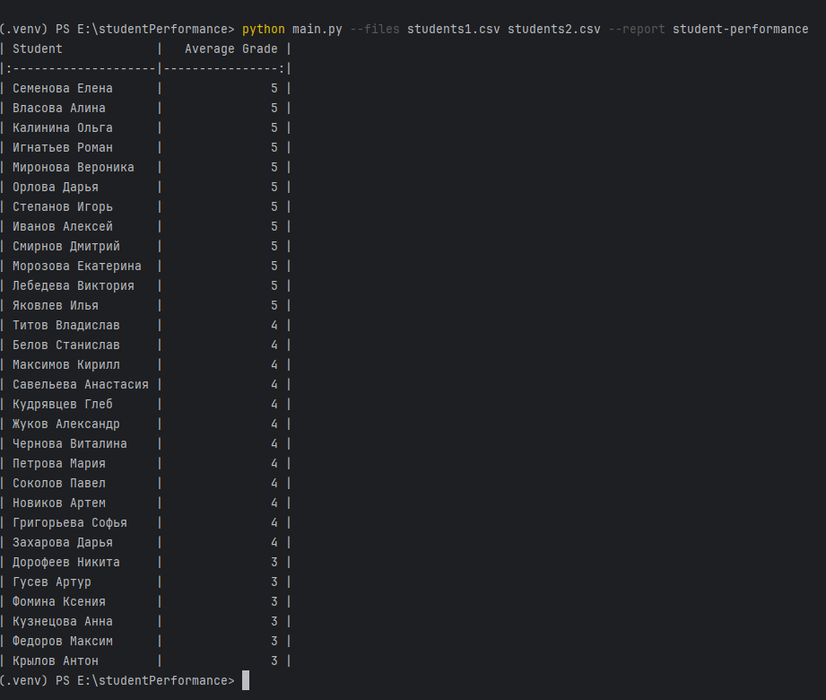

## Скрипт для формирования отчёта по успеваемости студентов. 
Скрипт принимает из командной строки название файла или файлов из которых надо прочитать данные и какой отчёт необходимо вывести в командную строку, например:
python main.py --files students1.csv students2.csv --report student-performance

Запуск автотестов командой pytest ./test.py

## Примеры работы скрипта

Вывод при парсинге студентов из двух файлов

При одном файле

В случае если название файла не корректно

